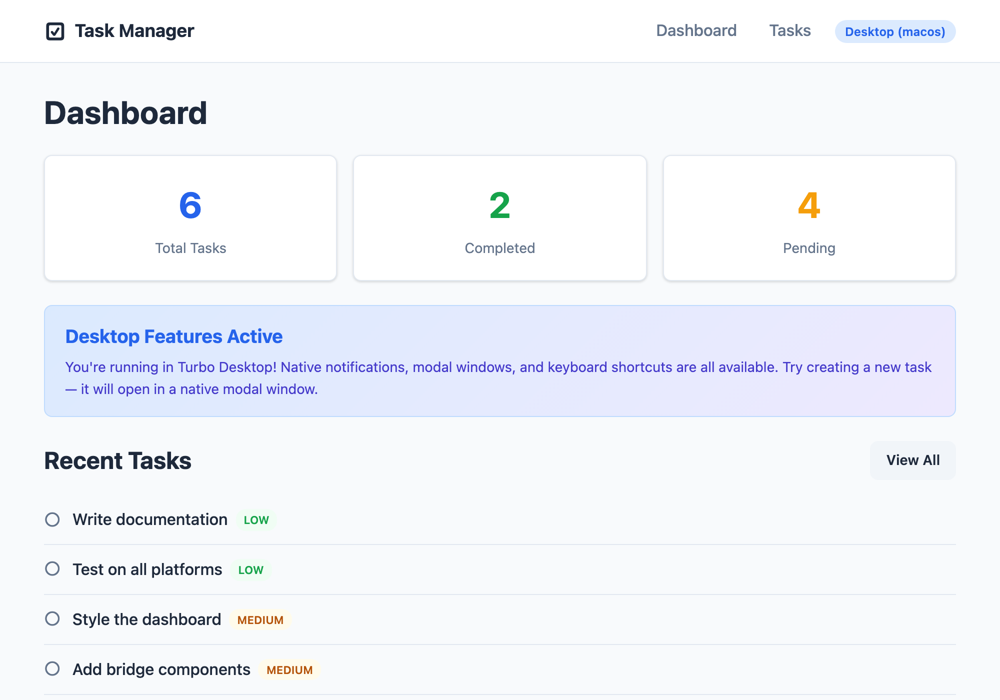
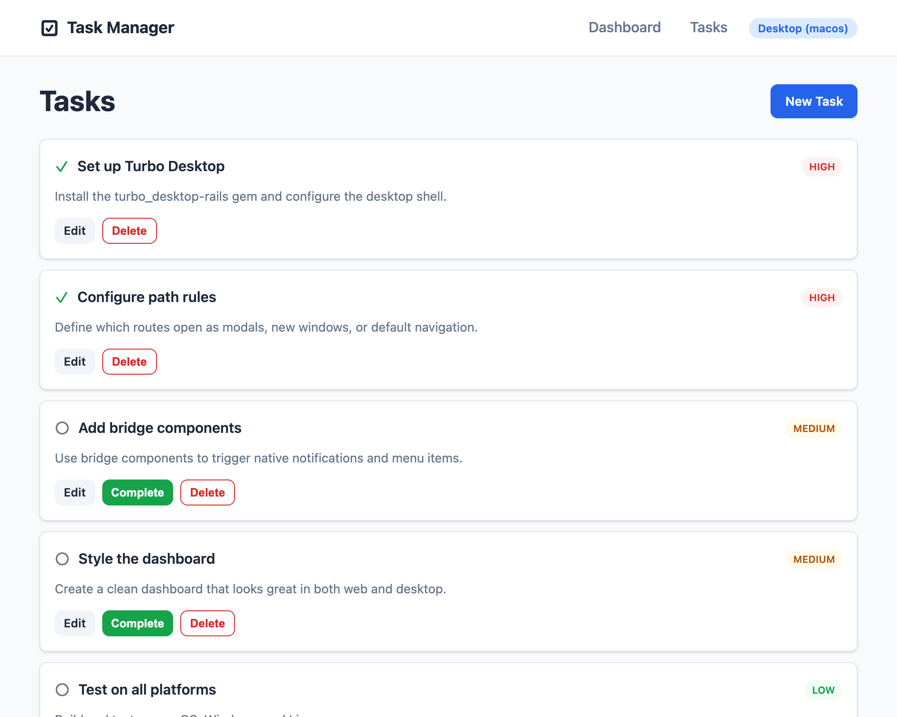
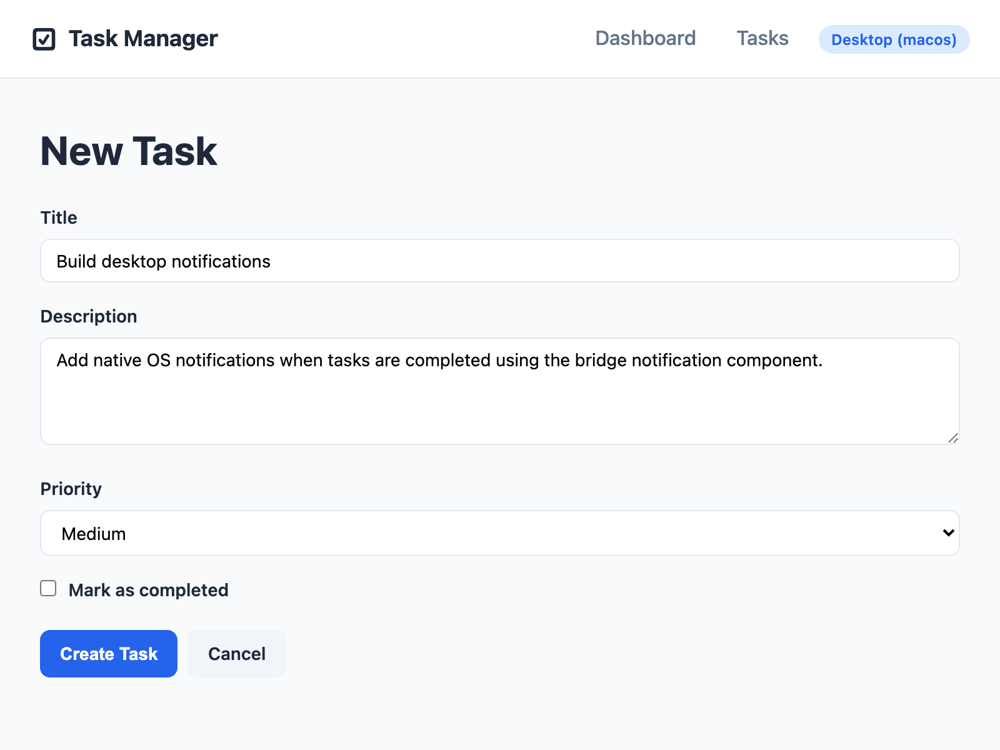

# Turbo Desktop Example App — Task Manager

A complete example [Rails](https://rubyonrails.org) application that demonstrates how to use [Turbo Desktop](https://github.com/aguspe/turbo_desktop) to wrap your Rails app in a native desktop shell.

This is a simple **Task Manager** that showcases:

- **Turbo Drive** navigation in a native window
- **Modal windows** for creating/editing tasks (via path configuration)
- **Native notifications** when tasks are completed (via bridge components)
- **Desktop-only UI** elements (native menu items, keyboard shortcuts)
- **System tray** integration
- **Path configuration** routing
- **Dev Inspector** — press <kbd>Cmd/Ctrl</kbd>+<kbd>Shift</kbd>+<kbd>D</kbd> in the desktop app for an
  in-app overlay of bridge traffic, active components, path-config presentation, and shell facts

## Dev Inspector

In the desktop shell (development), press <kbd>Cmd/Ctrl</kbd>+<kbd>Shift</kbd>+<kbd>D</kbd> to toggle
the Dev Inspector. It's enabled here via `config.inspector_enabled` in
`config/initializers/turbo_desktop.rb` and the `turbo_desktop_inspector_meta_tag` in the layout
`<head>`; the gem serves the inspector's JavaScript same-origin, so no extra setup is needed.

## Screenshots

### Dashboard
The dashboard shows task statistics, a "Desktop Features Active" banner (only visible in the native app), and recent tasks. The `turbo_desktop_only` helper controls what's shown in the desktop shell vs a regular browser.



### Task List
The task list displays all tasks with status indicators, priority badges, and action buttons. The "New Task" button links to `/tasks/new` which the path configuration routes to a native modal window.



### New Task — Modal Window
Creating a new task opens in a native modal window, configured via path configuration rules. The form uses standard Rails form helpers with Turbo. Any URL matching `/new$` or `/edit$` opens as a modal overlay.



## Prerequisites

- **Ruby** >= 3.1.0
- **Rails** >= 7.0
- **Node.js** >= 18
- **Rust** (for Tauri) — install from [rustup.rs](https://rustup.rs)

## Setup

### 1. Clone and install

```bash
git clone https://github.com/aguspe/turbo_desktop_example_app.git
cd turbo_desktop_example_app
bundle install
rails db:create db:migrate db:seed
```

### 2. Install the Turbo Desktop shell

```bash
# Install Tauri CLI
cargo install tauri-cli

# The desktop shell files are in the desktop/ directory
cd desktop
npm install
```

### 3. Run in development

```bash
# Terminal 1: Start the Rails server
bin/rails server

# Terminal 2: Start the Turbo Desktop shell
cd desktop
cargo tauri dev
```

The desktop app will open and load your Rails app at `http://localhost:3000`.

## Project Structure

```
turbo_desktop_example_app/
├── app/
│   ├── controllers/
│   │   ├── application_controller.rb
│   │   ├── tasks_controller.rb        # CRUD for tasks
│   │   └── dashboard_controller.rb    # Home page
│   ├── models/
│   │   └── task.rb                    # Task model
│   ├── views/
│   │   ├── layouts/
│   │   │   └── application.html.erb   # Main layout with desktop detection
│   │   ├── dashboard/
│   │   │   └── index.html.erb         # Dashboard view
│   │   └── tasks/
│   │       ├── index.html.erb         # Task list
│   │       ├── new.html.erb           # New task form (opens as modal)
│   │       ├── edit.html.erb          # Edit task form (opens as modal)
│   │       ├── show.html.erb          # Task detail
│   │       └── _form.html.erb         # Shared form partial
│   ├── assets/stylesheets/
│   │   └── application.css            # Styles
│   └── javascript/controllers/
│       └── notification_controller.js # Bridge component for notifications
├── config/
│   ├── routes.rb                      # Route definitions
│   └── initializers/
│       └── turbo_desktop.rb           # Path configuration rules
├── db/
│   ├── migrate/
│   │   └── 001_create_tasks.rb        # Tasks table
│   └── seeds.rb                       # Sample data
├── desktop/                           # Turbo Desktop shell (Tauri)
│   ├── turbo-desktop.config.json      # Desktop app configuration
│   └── package.json
├── Gemfile
└── README.md
```

## Key Concepts Demonstrated

### Path Configuration

The path configuration in `config/initializers/turbo_desktop.rb` controls how different URLs are presented:

```ruby
TurboDesktop.configure do |config|
  config.path_configuration = {
    rules: [
      # Default: navigate in the current window
      { patterns: ["/"], properties: { presentation: "default" } },

      # New/edit forms open as modal windows
      { patterns: ["/new$", "/edit$"], properties: { presentation: "modal" } },
    ]
  }
end
```

### Bridge Components

The notification controller in `app/javascript/controllers/notification_controller.js` shows how to send native OS notifications from your Rails views:

```javascript
// Uses TurboDesktop.sendBridgeMessage() to trigger native notifications
TurboDesktop.sendBridgeMessage("notification", "connect", {
  title: "Task Completed!",
  body: "Your task has been marked as done."
});
```

### Desktop Detection

Use the `turbo_desktop-rails` gem helpers to show different UI for desktop vs web:

```erb
<%= turbo_desktop_only do %>
  <p>You're using the desktop app!</p>
<% end %>

<%= turbo_web_only do %>
  <p>Try our desktop app for native features!</p>
<% end %>
```

## Learn More

- [Turbo Desktop](https://github.com/aguspe/turbo_desktop) — The framework
- [Turbo Desktop Wiki](https://github.com/aguspe/turbo_desktop/wiki) — Full documentation with screenshots
- [Tauri](https://tauri.app) — The native shell runtime
- [Hotwire](https://hotwired.dev) — Turbo Drive, Frames, and Stimulus

## License

MIT
